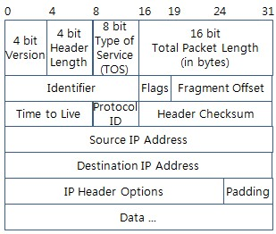

# IPv4

IPv4에 대해 들어가기전 v1,v2,v3와 v5는 어디 갔을까?

[Where is IPv1, 2, 3,and 5? - Alert Logic](https://www.alertlogic.com/blog/where-is-ipv1-2-3-and-5/)

****Where is IPv1, 2, 3,and 5?****

Internet Protocol(IP)는 처음부터 네트워크의 주소들을 관리하는 방법으로 디자인 되지 않았다.

IP는 원래 네트워크 스택을 계층 4에서 TCP(전송 제어 프로토콜)로, 계층 3에서 IP를 분할하는 기술로 의도되었다.

그 당시 TCP의 설계는 두 가지 문제점을 동시에 해결하기 위해 노력 중 이었는데 2가지 문제는 어떻게 데이터를 패키징 할 것 인가와 어떻게 해당 데이터를 다른 곳으로 보낼 것 인가이다.

**TCP의 히스토리**

TCP 버전 1 은 1973년에 디자인 되었다. RFC675에 기록되어 있다.

TCP 버전 2 는 1977년 3월에 기록되었다.

1977년 8월에 Jon Postel이라는 사람이 TCP가 잘못된 방향으로 가고 있다고 했다.

잘못된 방향은 위에서 언급했던 2가지 문제를 동시에 해결하려는 방향이다.

즉, 설계된 TCP는 계층화 원칙을 위반하면서 인터넷 프로토콜 설계를 망치고 있다는 주장이다.

TCP를 호스트 수준의 종단간 연결을 위한 프로토콜 역할과 인터넷 패키징 및 라우팅 프로토콜 역할을 동시에 하려고 한다. 이는 잘못되었다.

TCP는 엄격히 호스트 수준의 종단간 프로토콜로 사용되어야 하며 

인터넷 패키징과 라우팅을 위한 별개의 프로토콜이 필요하다고 주장!

이런 요점으로 TCP와 IP 가 분리됨! 둘 다 버전 3로 1978년 봄에 나옴

여기에 안정성이 추가된 IPv4 가 탄생 됨!

## **요약!**

TCP 버전 1,2가 호스트 수준 종단간 연결을 위한 프로토콜과 인터넷 패키징 및 라우터를 위한 프로토콜 두 가지 역할을 동시에 만족하는 프로토콜로 설계 됨

이건 잘못된 방법이야!

TCP는 종단간 역할을 위한 프로토콜로만 사용되어야 하며, 인터넷 패키징 및 라우팅를 위한 새로운 프로토콜이 필요해!

TCP가 분할되어 TCP 버전 3 와 IPv3의 등장!

여기에 안정성이 추가 되어 현재의 IPv4가 됨

**IPv5는 어디에?** 

IPv5도 버전4의 문제점들을 해결하기 위해 RFC1190이 제출되었고 Apple, Sum, IBM 및 다른 회사들이 IPv5를 구현하려고 시도하였지만 궁극적으로 대역폭, 애플리케이션 및 압축의 일반적인 개선으로 인해 IPv4가 문제 없이 잘 성장했다.

# IPv4

**개요**

1. IPv4는 비신뢰적이고 비연결형인 데이터그램 프로토콜로 최선형 전송 서비스 이다.
2. 여기서 최선형 전송의 의미는 IPv4 패킷이 훼손되거나 손실, 순서에 맞지 않게 도착, 지연되어 도착 그리고 네트워크에 혼잡을 발생시킬 수 있는 것을 뜻함
3. 신뢰성이 중요하다면 IPv4는 TCP 처럼 신뢰성 있는 전송 계층 프로토콜과 함께 사용되어야함
4. 모든 TCP/UDP, ICMP, IGMP 데이터는 IP 데이터 그램을 사용하여 전송된다.

**IPv4 데이터그램 형식**

IP가 사용하는 패킷을 데이터그램 이라고 한다.

데이터그램은 가변 길이의 패킷으로 헤더와 페이로드(데이터)로 이루어져 있다.

헤더는 20에서 60 바이트 길이이며 라우팅과 전송에 필수적인 정보를 가지고 있다.



Version: ip의 버전을 의미 Ipv4는 4의 값을 가짐

Header Length: IPv4의 가변 헤더 길이를 표시함 4비트 -> 0~15 인데 4를 곱해서 0~60 byte를 표시

Type of Service: 데이터그램이 라우터에 의해 어떻게 처리되어야 하는지 알려줌

Total Packet Length(in bytes): 16 bit → 0~65535 데이터그램의 전체 바이트 수를 정의

Identifier, Flags,  Fragment Offset: 이 3가지는 단편화와 관련이 있음 즉 패킷을 분할해서 보낼 때 순서와 위치에 맞춰 조립하고 그럴 때 필요함

Time To Live(TTL): 라우터를 거치면서 최대 방문할 수 있는 수, 이 값이 0이되면 라우터는 패킷을 폐기한다. 즉 무한으로 네트워크를 돌아 다니지 않게함

Protocol: 다중화와 관련 있음 대표적인 값 6→TCP, 17→UDP, 어느 프로토콜로 페이로드가 전달되어야하는지 알려줌

Header Checksum: 헤더를 검사하기 위한 필드, 라우터를 지날 때마다 TTL 값이 달라지기 때문에 라우터에서 검사합의 값은 다시 계산되어야 함

Source IP, Destination IP: 출발지, 목적지 주소

Option: 데이터그램 헤더는 40바이트 까지 옵션을 가질 수 있음, 옵션은 네트워크 테스트와 디버깅에 사용됨, 옵션은 필수적인 것은 아니지만 옵션을 처리하기 위해서는 옵션 처리를 위한 IP 소프트웨어가 필요함

Payload: 페이로드는 IP를 사용하는 상위 계층에서 오는 데이터임

IP 주소의 길이

총 길이 : 32bit → 4 byte

2^32=4,294,967,296 (약 42억 개)

Dotted Decimal Notation 부점 10진 표기법이라고 함

 바이트 단위로 끊어서 십진수로 표기 후 .을 넣음

127.0.0.1 

192.168.0.1

1 바이트는 0~255까지 가능

00000000 → 0

11111111 → 255

IPv4에서 알아두면 좋은 것!

IP의 주소는 한정되어 있다. 

이를 효율적으로 활용하기 위해 대역을 정해 역할을 나누었다.

[RFC 3330 - Special-Use IPv4 Addresses](https://datatracker.ietf.org/doc/html/rfc3330)

```
3. Summary Table

   Address Block             Present Use                       Reference
   ---------------------------------------------------------------------
   0.0.0.0/8            "This" Network                 [RFC1700, page 4]
   10.0.0.0/8           Private-Use Networks                   [RFC1918]
   14.0.0.0/8           Public-Data Networks         [RFC1700, page 181]
   24.0.0.0/8           Cable Television Networks                    --
   39.0.0.0/8           Reserved but subject
                           to allocation                       [RFC1797]
   127.0.0.0/8          Loopback                       [RFC1700, page 5]
   128.0.0.0/16         Reserved but subject
                           to allocation                             --
   169.254.0.0/16       Link Local                                   --
   172.16.0.0/12        Private-Use Networks                   [RFC1918]
   191.255.0.0/16       Reserved but subject
                           to allocation                             --
   192.0.0.0/24         Reserved but subject
                           to allocation                             --
   192.0.2.0/24         Test-Net
   192.88.99.0/24       6to4 Relay Anycast                     [RFC3068]
   192.168.0.0/16       Private-Use Networks                   [RFC1918]
   198.18.0.0/15        Network Interconnect
                           Device Benchmark Testing            [RFC2544]
   223.255.255.0/24     Reserved but subject
                           to allocation                             --
   224.0.0.0/4          Multicast                              [RFC3171]
   240.0.0.0/4          Reserved for Future Use        [RFC1700, page 4]
```

1. **사설 네트워크 대역**
    1. 10.0.0.0/8 → 10.0.0.0 ~10.255.255.255
    2. 172.16.0.0/12 → 172.16.0.0 ~ 172.31.255.255
    3. 192.168.0.0/16 → 192.168.255.255
    
     
    
2. **특수 주소** 

**디스-호스트(this-host) 주소**: 0.0.0.0/32 주소를 디스 호스트 주소라고 한다. 

이 주소는 호스트가 IP 데이터그램을 보내려고 하지만 근원지 주소인 자신의 주소를 모를 때 사용한다.

**제한된 브로드캐스트 주소**: 255.255.255.255/32 주소는 제한된 브로드 캐스트 주소이다. 

이 주소는 호스트나 라우터가 네트워크상의 모든 장치로 데이터그램을 보낼 때 사용된다. 

그러나 네트워크상의 라우터가 이런 패킷을 차단하기 때문에 네트워크 외부로 패킷을 보낼 수 없음

**루프백 주소:** 127.0.0.0/8의 블록은 루프백 주소이다. 

이 블록 내의 주소를 가진 패킷은 호스트를 벗어나지 않고 호스트에 남게 된다. 

블록 내의 주소는 소프트웨어 테스트 목적으로 사용됨 

127.0.0.1은 테스트에 가장 많이 사용되는 주소