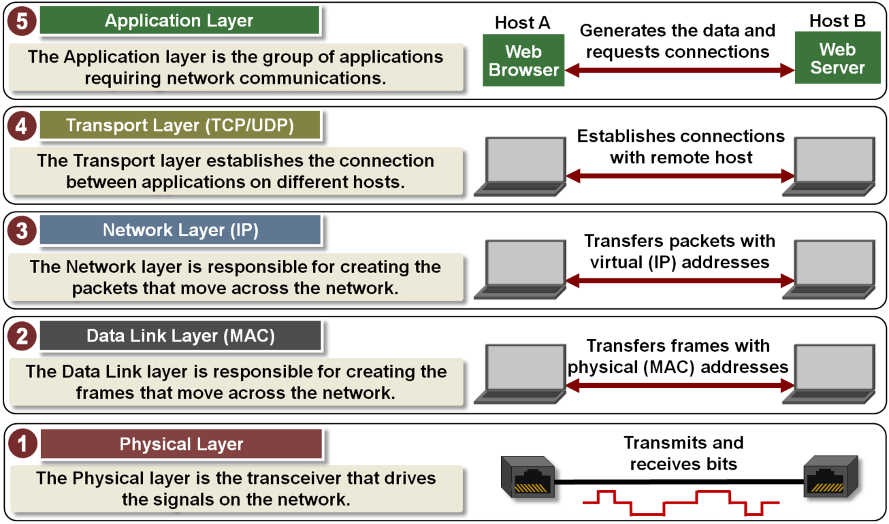

# OSI 7계층과 TCP/IP 4계층

# OSI(Open System Interconnection)

## **정의**

OSI 모델은 국제표준화기구(ISO)에서 개발한 모델로 컴퓨터 네트워크 프로토콜 디자인과 통신을 계층으로 나누어 설명한 것이다.

약어를 보면 **Open System Interconnection**이다. 

이름으로 유추를 해 보았을 때 개방 시스템 간의 연결을 위한 표준이다.

“개방 시스템”은 기반 구조와 관계없이 시스템 간의 통신을 제공하는 프로토콜의 집합이다.

OSI 모델은 하드웨어나 소프트웨어 기반의 논리적인 변화에 대한 요구 없이 서로 다른 시스템 간의

통신을 원활하게 하는 데 그 목적이 있다.

이러한 표준이 없다면?

시스템 간 통신이 이루어지지 않게 된다.

예를 들어 각 시스템 마다 통신에 대한 표준 없이 서로 다른 기준을 가지고 통신을 하게 된다면

같은 비트의 데이터라도 서로 다르게 해석되고 의미가 없는 더미 데이터가 되어 통신이 불가능 하다. 이를 해결하기 위해서 한 쪽은 다른 쪽에 맞춰야 하는데 연결되는 시스템이 늘어날 수록 이는 막대한 비용이 든다.

## 계층 별 특징

1. **물리 계층(Physical layer)**
    1. 데이터를 물리 매체상으로 전송하는 역할을 담당하는 계층, 전송을 위한 물리적 링크의 설정, 유지, 해제를 담당
    2. 사용자 장비와 네트워크 종단 장비 사이의 물리적, 전기적 인터페이스 규정에 초점을 두고 있다. 전송 선로의 종류에 따라 전송방식과 인코딩 방식이 다르다.
    
2. **데이터링크 계층(Data link layer)**
    1. 물리 계층의 있는 그대로의 전송 설비를 신뢰할 수 있는 링크로 변환한다. 이는 상위 계층인 네트워크 계층에게 오류 없는 물리 계층으로 보이도록 한다.
    2. 물리계층에서 전송하는 비트에 대한 동기 및 식별 기능과 흐름제어, 오류제어 기능 등을 수행
    3. **논리적 연결을 담당**하는 **LLC**(Logic Link Control 또는 DLC Data Link Control)와 장비와 장비간의 **물리적인 접속을 담당**하는 **MAC**(Media Access Control) 두 sub 계층으로 나뉘어진다.
    4. 데이터링크 계층에서 다루어지는 데이터 단위를 일반적으로 프레임이라고 부른다.
    
3.  **네트워크 계층(Network layer)**
    1. 송신자측에서 수신자측까지 데이터를 안전하게 전달하기 위해서 논리적 링크를 설정하고 상위 계층 데이터를 작은 크기의 패킷으로 분할하여 전송하는 역할을 수행

1. **전송계층(Transport layer)**
    1. OSI의 7계층 구조는 전송 계층을 기점으로 하위 계층으로 이루어진 네트워크 서비스와 상위 계층으로 이루어진 사용자 서비스로 구별될 수 있다.
    2. 전송 계층은 세션을 맺고 있는 두 사용자 사이의 데이터 전송을 위한 종단간(End to End) 제어를 담당
    3. 종단간 전송은 단순히 한 컴퓨터에서 다음 컴퓨터로의 전달이 아니라, 송신 컴퓨터의 응용프로그램에서 최종 수신 컴퓨터의 응용프로그램으로의 전달을 의미
    
2. **세션 계층(Session layer)**
    1. 프로세스 사이에서 세션이라고 불리는 연결을 확립하고 유지하며 동기화 하는 기능을 제공
    2. 세션 계층은 표현 계층으로부터 받은 데이터를 효율적인 세션 관리를 위해 짧은 데이터 단위로 나눈 후에 전송 계층으로 내려 보냄
    
3. **표현 계층(Presentation layer)**
    1. 송 수신자가 공통으로 이해할 수 있도록 정보의 데이터 표현 방식을 바꾸는 기능을 담당
    2. 표현 계층은 응용 프로그램 계층으로부터 데이터를 받아서 표준 포맷으로 변환시킨다. 표현 계층에서 동작하는 프로토콜은 존재하지 않는다.
    
4. **응용 계층(Application layer)**
    1. 최상위 계층으로 사용자(사람 또는 소프트웨어)가 네트워크에 접속하는 것을 가능하게 한다.
    2. 전자우편, 원격 파일 접속과 전송, 공유된 데이터베이스 관리, 등 다양한 서비스를 지원하고 사용자 인터페이스를 제공한다.
    
    # TCP/IP 4 계층
    
    TCP/IP 모델은 OSI 모델보다 먼저 개발되었다.
    
    탄생 년도와 배경이 다르지만 굳이 비교하자면
    
    OSI가 네트워크에 대한 표준 모델
    
    TCP/IP는 OSI와 같은 계층적 구조를 갖는 모델이지만 좀 더 단순화되고 실질적인? 모델이다.
    
    
    
    그림을 보면 5 계층으로 나와있는데 일반적으로 1,2 계층을 묶어 데이터 링크 계층으로 본다.
    
    1. **물리 계층**
        1. 0과 1로 표현된 데이터를 전기 신호로 변환하거나 전기 신호를 이진 데이터로 변환하는 역할을 수행
    2. **데이터 링크 계층**
        1. 장비 간의 데이터를 전송하는 역할, MAC주소를 통해 프레임을 전달한다.
        2. 주요 프로토콜로 이더넷이 있다.
    3. **네트워크 계층**
        1. IP주소를 기반으로 네트워크 상에서 데이터의 전송을 담당한다.
        2. 주 장비로는 라우터가 있고 라우터는 라우팅 테이블을 통해 패킷을 목적지로 Forwording 한다.
        3. 주요 프로토콜로 IP, ARP, RARP, ICMP 가 있다.
    4. **전송 계층**
        1. End to End 전송을 담당
        2. 대표적은 프로토콜로 TCP와 UDP가 있다.
    5. **응용 계층**
        1. 최상위 계층으로 사용자와 가장 가까운 계층
        2. 대표적인 프로토콜로 HTTP, FTP, SMTP 등
        3. 개발자가 가장 잘 알아야 하는 계층